# 语音处理流程图

本文档使用Mermaid语法提供可视化的流程图。您可以在支持Mermaid的Markdown查看器中查看这些图表。

## 1. 系统架构总览

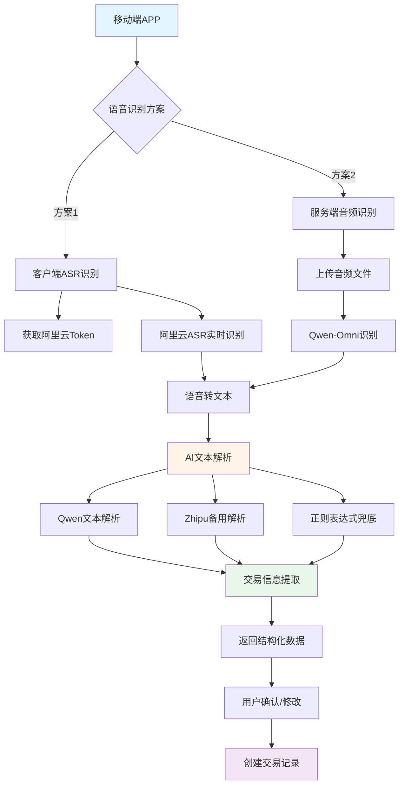

## 2. 方案1：客户端语音识别流程

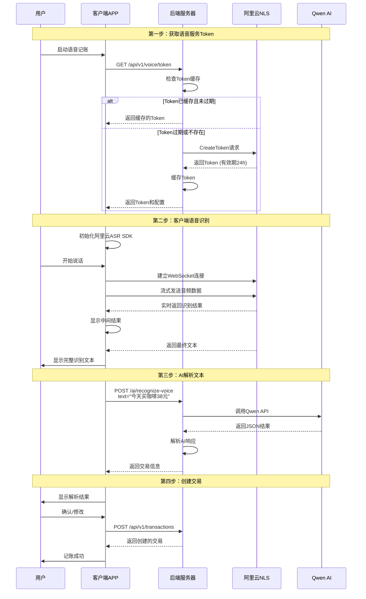

## 3. 方案2：服务端音频识别流程

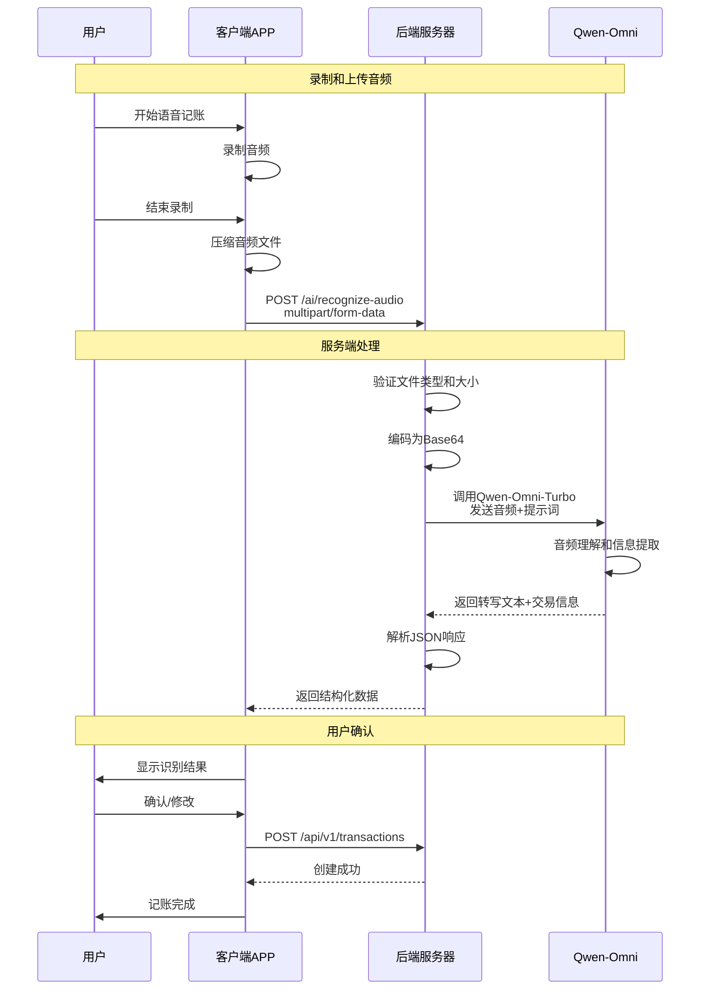

## 4. Token获取详细流程

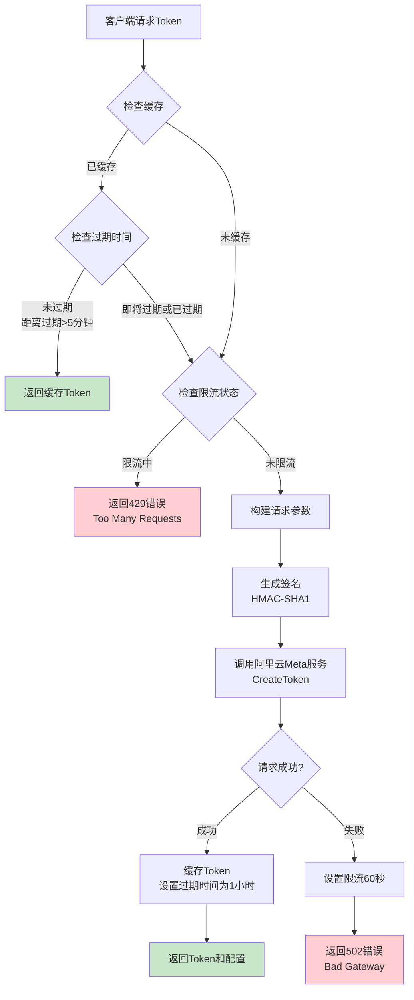

## 5. AI文本解析流程

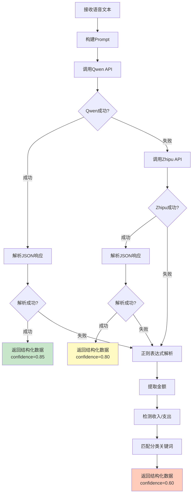

## 6. 正则表达式解析逻辑

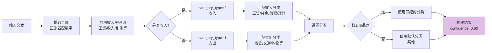

## 7. 错误处理流程

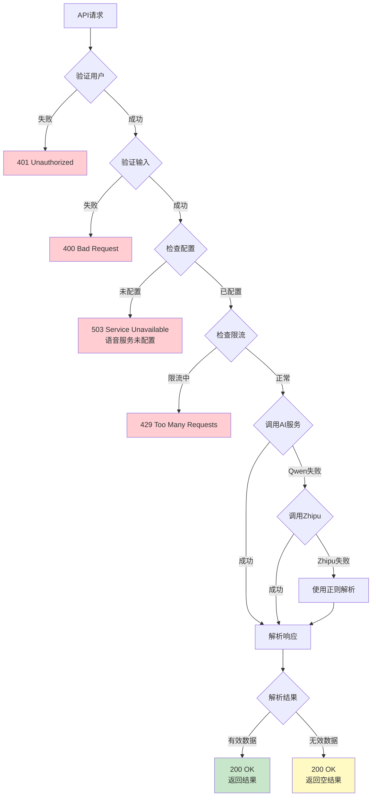

## 8. 分类系统决策树

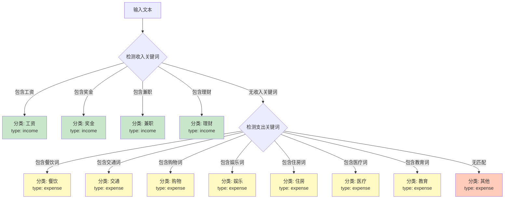

## 9. 音频识别详细流程（Qwen-Omni）

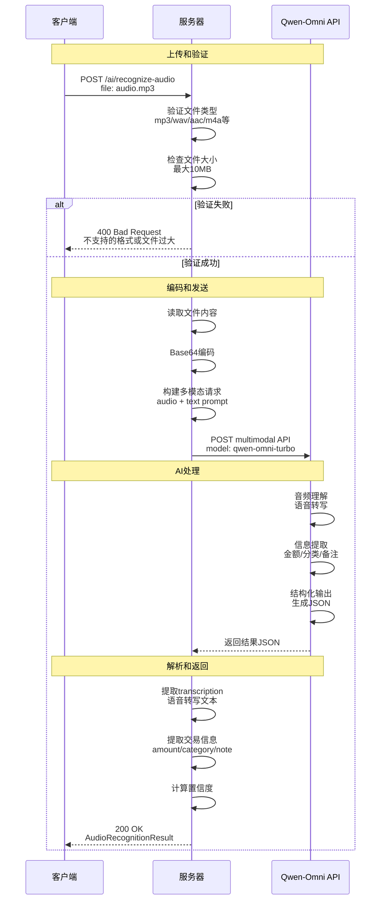

## 10. 性能优化策略

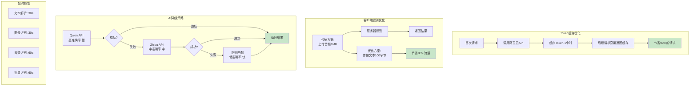

## 11. 数据流转换

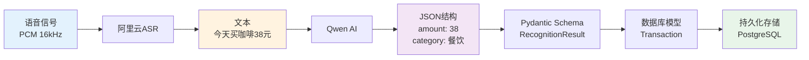

## 12. 完整用户交互流程

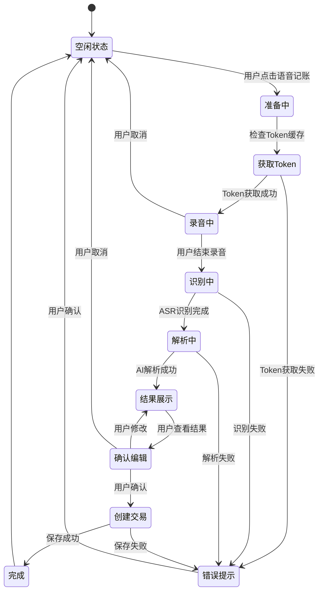

## 13. 置信度评分系统

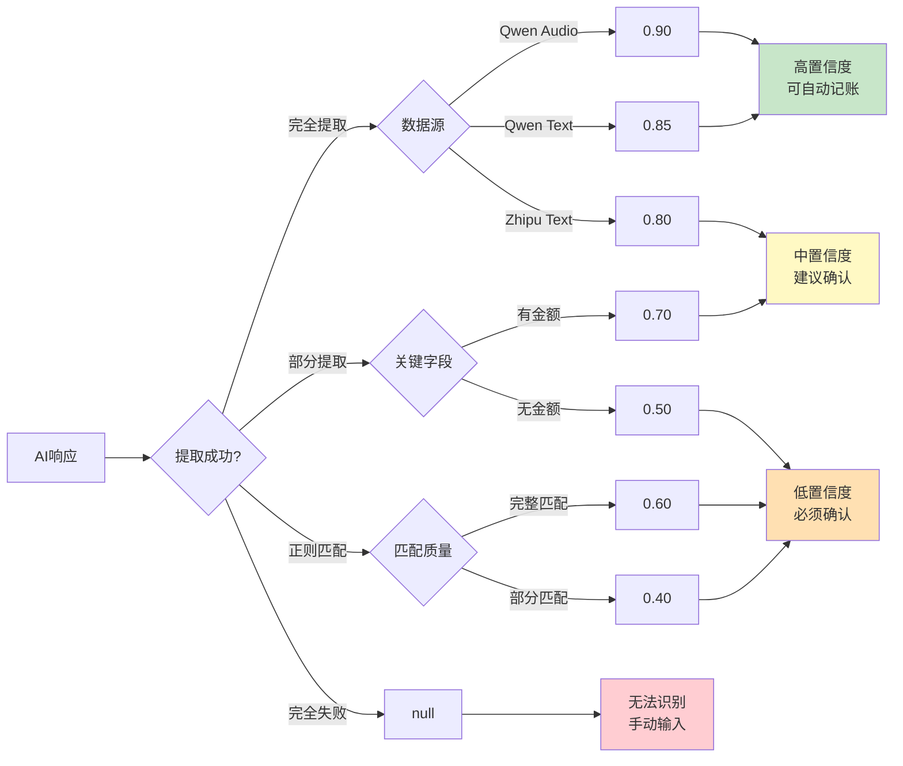

## 使用说明

### 在GitHub/GitLab查看

这些Mermaid图表可以在GitHub、GitLab等平台的Markdown预览中直接渲染显示。

### 在本地查看

1. 使用支持Mermaid的Markdown编辑器：
   - VS Code + Mermaid插件
   - Typora
   - Obsidian

2. 在线预览：
   - [Mermaid Live Editor](https://mermaid.live/)
   - 复制代码块到在线编辑器

### 导出为图片

使用Mermaid CLI工具：
```bash
npm install -g @mermaid-js/mermaid-cli
mmdc -i VOICE_PROCESSING_DIAGRAMS.md -o diagrams.pdf
```

---

**相关文档**: [语音处理工作流程](./VOICE_PROCESSING_WORKFLOW.md)
