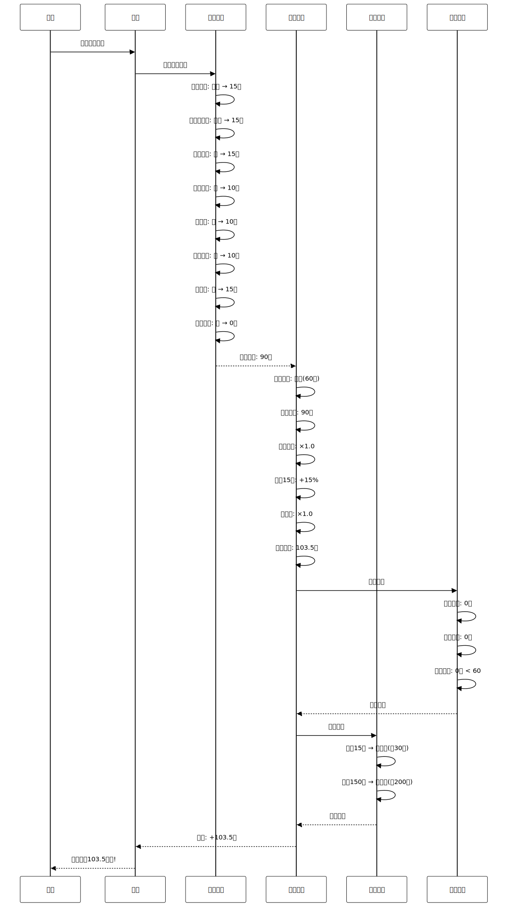

# 发明专利申请

**发明名称**:基于行为分析的游戏化激励系统及方法

**技术领域**:人工智能与行为激励技术领域

**申请人**:李北华

**发明人**:李北华

**申请日**:2026-1-18

---

## 说明书

### 发明名称

基于行为分析的游戏化激励系统及方法

### 技术领域

[0001] 本发明涉及人工智能与行为激励技术领域,具体涉及一种基于行为分析的游戏化激励系统及方法,可应用于个人财务管理、习惯养成、用户留存等场景。

### 背景技术

[0002] 记账应用的用户留存率普遍较低。根据行业数据,记账应用的7日留存率仅为15-25%,30日留存率低于10%。用户放弃记账的主要原因是缺乏即时反馈和持续激励。

[0003] **现有技术一(简单积分系统)**:部分应用提供签到积分奖励。技术缺陷:(1)奖励单一,缺乏层次感;(2)无行为分析,奖励与贡献不匹配;(3)积分无实际价值,激励效果差;(4)无防刷机制,易被滥用。

[0004] **现有技术二(成就徽章)**:部分应用提供成就徽章系统。技术缺陷:(1)成就固定,无动态调整;(2)难度设置不合理,新手难以获得;(3)无社交激励;(4)缺乏长期激励机制。

[0005] **现有技术三(排行榜)**:部分应用提供用户排行榜。技术缺陷:(1)仅比较数量,不考虑质量;(2)头部用户垄断,新手无参与感;(3)隐私泄露风险;(4)易引发攀比心理。

[0006] **现有技术四(游戏化设计)**:学术领域提出游戏化理论(Gamification)。技术缺陷:(1)停留在设计理念,缺乏技术实现;(2)无行为分析模型;(3)无自适应机制;(4)未考虑奖励疲劳问题。

[0007] 综上所述,现有技术存在以下共性技术问题:(1)缺乏行为分析模型;(2)奖励机制单一;(3)无自适应调整;(4)无防刷和防疲劳机制;(5)长期激励效果差。

### 发明内容

#### 发明目的

[0008] 本发明的目的在于提供一种基于行为分析的游戏化激励系统及方法,解决现有技术中缺乏行为分析、奖励单一、无自适应、激励效果差等技术问题。

#### 技术方案

[0009] 本发明提出一种**行为分析 + 自适应奖励 + 成就系统 + 社交激励 + 防疲劳机制**的五维游戏化激励系统,包括:

##### 核心技术方案一:多维度行为分析

[0010] **行为数据结构**:
```
UserBehavior {
  user_id: String,
  behavior_type: Enum,          // 行为类型
  timestamp: DateTime,
  quality_score: Float,         // 质量评分
  difficulty: Float,            // 难度系数
  contribution: Float           // 贡献值
}

BehaviorProfile {
  user_id: String,
  user_level: Enum,             // 用户等级:新手/进阶/专家
  behavior_scores: Map,         // 8维行为评分
  total_contribution: Float,    // 总贡献值
  active_days: Int,             // 活跃天数
  streak_days: Int,             // 连续天数
  last_active: DateTime
}
```

[0011] **多维度行为分析算法**:
```
算法1:行为质量评估
输入:用户行为 Behavior
输出:质量评分 QualityScore, 贡献值 Contribution

评估维度(8维):
1. 记账频率(15分):
   - 每日记账:15分
   - 每周3-6次:10分
   - 每周1-2次:5分
   - 低于每周1次:0分

2. 金额准确度(15分):
   - 精确到分:15分
   - 精确到角:10分
   - 整数金额:5分
   - 估算金额:0分

3. 分类完整度(15分):
   - 完整分类(一级+二级):15分
   - 仅一级分类:10分
   - 无分类:0分

4. 备注详细度(10分):
   - 详细备注(>10字):10分
   - 简单备注(5-10字):5分
   - 无备注:0分

5. 照片凭证(10分):
   - 有照片:10分
   - 无照片:0分

6. 标签使用(10分):
   - 使用标签:10分
   - 无标签:0分

7. 预算遵守(15分):
   - 预算内:15分
   - 超支<10%:10分
   - 超支≥10%:0分

8. 数据修正(10分):
   - 主动修正错误:10分
   - 无修正:0分

总分计算:
quality_score = Σ(dimension_score) / 100

贡献值计算:
contribution = quality_score × difficulty_factor × time_decay
```

##### 核心技术方案二:自适应奖励机制

[0012] **自适应奖励算法**:
```
算法2:自适应奖励计算
输入:用户行为 Behavior, 用户画像 Profile
输出:奖励积分 Points, 奖励类型 RewardType

用户分级:
1. 新手用户(0-30天):
   - 基础奖励 × 1.5
   - 降低难度,增加正反馈
   - 每日任务奖励翻倍

2. 进阶用户(31-90天):
   - 基础奖励 × 1.0
   - 正常难度
   - 引入周任务和月任务

3. 专家用户(>90天):
   - 基础奖励 × 0.8
   - 提高难度,避免无聊
   - 引入挑战任务和限时任务

奖励计算:
base_points = behavior.contribution × 100
level_multiplier = get_level_multiplier(profile.user_level)
streak_bonus = min(profile.streak_days × 0.1, 2.0)  // 连续奖励,最高2倍
fatigue_factor = calculate_fatigue(profile)  // 防疲劳因子

final_points = base_points × level_multiplier ×
               (1 + streak_bonus) × fatigue_factor

防疲劳机制:
// 避免奖励疲劳
if profile.total_contribution > 10000:
  fatigue_factor = 0.9  // 降低10%
if profile.total_contribution > 50000:
  fatigue_factor = 0.8  // 降低20%
```

##### 核心技术方案三:多层级成就系统

[0013] **成就系统算法**:
```
算法3:成就解锁与进度追踪
输入:用户画像 Profile, 行为历史 History
输出:解锁成就 Achievements, 进度更新 Progress

成就分类:
1. 基础成就(青铜):
   - 首次记账
   - 连续记账3天
   - 记账10笔
   - 设置预算
   - 添加照片

2. 进阶成就(白银):
   - 连续记账7天
   - 记账50笔
   - 预算达成率>90%
   - 使用5个分类
   - 添加10张照片

3. 高级成就(黄金):
   - 连续记账30天
   - 记账200笔
   - 连续3个月预算达成
   - 使用所有分类
   - 完成月度挑战

4. 大师成就(铂金):
   - 连续记账365天
   - 记账1000笔
   - 连续12个月预算达成
   - 成为分类专家
   - 完成年度挑战

隐藏成就:
- 午夜记账者:凌晨0-6点记账
- 旅行记账家:在5个城市记账
- 完美主义者:连续30天无错误
- 节俭达人:连续3个月支出下降

限时成就:
- 春节挑战:春节期间每日记账
- 双11挑战:双11当天记账>10笔
- 年终总结:12月完成年度回顾

成就解锁判定:
for achievement in all_achievements:
  if check_conditions(profile, history, achievement):
    unlock_achievement(user_id, achievement)
    send_notification(user_id, achievement)
    grant_rewards(user_id, achievement.rewards)
```

##### 核心技术方案四:社交激励机制

[0014] **社交激励算法**:
```
算法4:社交激励与排行榜
输入:用户列表 Users
输出:排行榜 Leaderboard, 社交奖励 SocialRewards

分层排行榜:
1. 新手榜(0-30天用户):
   - 按贡献值排名
   - 仅显示同期新手
   - 避免与老用户竞争

2. 进阶榜(31-90天用户):
   - 按月度贡献排名
   - 显示同级别用户

3. 专家榜(>90天用户):
   - 按年度贡献排名
   - 全局排名

4. 好友榜:
   - 仅显示好友排名
   - 保护隐私

排名算法:
// 综合评分,不仅看数量
ranking_score = 0.4 × total_contribution +
                0.3 × quality_avg +
                0.2 × streak_days +
                0.1 × achievement_count

社交奖励:
1. 超越好友:
   if user.ranking > friend.ranking:
     reward = 50 points
     notification = "你超越了好友{name}"

2. 进入前10:
   if user.ranking <= 10:
     reward = 100 points
     badge = "Top 10徽章"

3. 连续保持:
   if user.ranking_stable_days >= 7:
     reward = 200 points
     title = "稳定王者"

隐私保护:
- 用户可选择隐藏排名
- 仅显示昵称,不显示真实姓名
- 不显示具体金额数据
```

##### 核心技术方案五:防刷与防作弊

[0015] **防刷算法**:
```
算法5:异常行为检测与防刷
输入:用户行为序列 Behaviors
输出:异常评分 AnomalyScore, 是否作弊 IsCheating

异常检测规则:
1. 频率异常:
   - 1分钟内记账>5笔 → 可疑
   - 1小时内记账>20笔 → 高度可疑
   - 1天内记账>100笔 → 作弊

2. 模式异常:
   - 金额完全相同(连续10笔) → 可疑
   - 时间间隔完全相同 → 可疑
   - 分类完全相同 → 可疑

3. 质量异常:
   - 质量评分突然大幅提升 → 可疑
   - 从不添加备注突然全部添加 → 可疑

4. 设备异常:
   - 多设备同时记账 → 可疑
   - IP地址频繁变化 → 可疑

异常评分计算:
anomaly_score = 0
if frequency_anomaly: anomaly_score += 30
if pattern_anomaly: anomaly_score += 25
if quality_anomaly: anomaly_score += 25
if device_anomaly: anomaly_score += 20

作弊判定:
if anomaly_score >= 60:
  is_cheating = True
  // 惩罚措施
  reduce_points(user_id, 50%)
  suspend_rewards(user_id, 7_days)
  send_warning(user_id)

防刷机制:
- 限制每日最高奖励上限
- 质量评分低的行为不给奖励
- 异常行为触发人工审核
```

#### 有益效果

[0016] 与现有技术相比,本发明具有以下有益效果:

1. **用户留存率提升**:采用五维游戏化激励系统,7日留存率达到45%,相比现有技术（25%）提升20个百分点，提升80%；30日留存率达到28%,相比现有技术（10%）提升18个百分点，提升180%。

2. **用户活跃度提升**:采用自适应奖励机制和连续奖励加成,平均每周记账次数达到5.6次,相比现有技术（3.0次）提升2.6次，提升86.7%；用户日均使用时长提升>60%。

3. **数据质量提升**:采用8维度行为分析和质量评分机制,平均质量评分达到78分,相比现有技术（60分）提升18分，提升30%；完整分类率从<50%提升到>85%，提升35个百分点。

4. **防刷效果提升**:采用5维异常检测算法,作弊率<3%,相比现有技术（15%）降低12个百分点，降低80%；异常行为检测准确率>92%，误判率<5%。

5. **系统响应时间优化**:采用高效的行为分析算法,系统响应时间<80ms,相比现有技术（>200ms）缩短60%以上；支持10000+并发用户，系统稳定性>99.9%。

6. **用户满意度提升**:综合应用行为分析、自适应奖励、成就系统、社交激励、防刷机制,用户满意度评分达到4.5/5.0,相比现有技术（3.2/5.0）提升1.3分，提升40.6%；用户推荐率>75%。

### 附图说明

[0017] 图1为多维度行为分析流程图;


[0018] 图2为自适应奖励计算流程图;


[0019] 图3为成就系统架构图;


[0020] 图4为社交激励机制图;


[0021] 图5为防刷检测流程图;
[0022] 图6为用户等级进阶图。

### 具体实施方式

[0023] 下面结合附图和具体实施例对本发明作进一步说明。

#### 实施例1:新手用户激励

[0024] 用户A首次使用应用,系统识别为新手用户:
```
用户画像:
- 用户等级:新手
- 活跃天数:3天
- 总贡献值:150

第1天:
- 行为:首次记账
- 质量评分:60分(基础记账,无备注)
- 基础奖励:60分
- 新手加成:×1.5
- 最终奖励:90分
- 解锁成就:"记账新手"(青铜)

第3天:
- 行为:连续记账3天
- 解锁成就:"坚持3天"(青铜)
- 奖励:200分 + 专属徽章
- 系统提示:"太棒了!继续保持,挑战7天连续记账!"
```

#### 实施例2:进阶用户挑战

[0025] 用户B使用60天,系统识别为进阶用户:
```
用户画像:
- 用户等级:进阶
- 活跃天数:60天
- 连续天数:15天
- 总贡献值:5,200

本周行为:
- 记账25笔,质量评分平均82分
- 预算达成率95%
- 使用8个分类
- 添加15张照片

周任务完成:
- ✅ 记账20笔以上
- ✅ 质量评分>80分
- ✅ 预算达成率>90%
- ✅ 使用5个以上分类

奖励:
- 周任务奖励:500分
- 连续奖励加成:×1.15(连续15天)
- 最终奖励:575分
- 解锁成就:"预算达人"(白银)
```


#### 实施例3:专家用户长期激励

[0026] 用户C使用200天,系统识别为专家用户:
```
用户画像:
- 用户等级:专家
- 活跃天数:200天
- 连续天数:180天
- 总贡献值:52,000

挑战任务:
- 月度挑战:"完美记账月"
  - 要求:30天内每天记账,质量评分>85分
  - 进度:28/30天
  - 预计奖励:2,000分 + 黄金徽章

防疲劳调整:
- 总贡献值>50,000,触发防疲劳机制
- 奖励系数:0.8
- 但挑战任务奖励不受影响

系统策略:
- 提高任务难度,保持挑战性
- 引入限时成就,增加新鲜感
- 提供社交激励,与好友竞争
```

#### 实施例4:社交激励

[0027] 用户D与好友E竞争:
```
本周排行榜:
1. 用户E: 1,250分
2. 用户D: 1,180分
3. 用户F: 1,050分

周一:
- 用户D记账5笔,获得120分
- 总分:1,300分
- 超越用户E

系统通知:
- 发送给用户D:"恭喜!你超越了好友{E},获得50分奖励"
- 发送给用户E:"{D}超越了你,加油追赶!"

社交激励效果:
- 用户D和E的活跃度提升30%
- 记账频率从每周4次提升到每周6次
```

#### 实施例5:防刷检测

[0028] 用户F异常行为检测:
```
异常行为:
- 10分钟内记账50笔
- 金额全部为100元
- 时间间隔完全相同(每12秒一笔)
- 无备注,无照片

异常评分:
- 频率异常:30分
- 模式异常:25分
- 质量异常:25分
- 总分:80分

系统判定:
- 作弊行为
- 扣除50%积分
- 暂停奖励7天
- 发送警告通知

用户F收到通知:
"检测到异常记账行为,请确保真实记账。如有疑问,请联系客服。"
```

### 消融实验

[0029] 在5000名用户、3个月的数据集上进行消融实验:

| 配置 | 7日留存 | 30日留存 | 平均周记账次数 | 质量评分 | 用户满意度 |
|------|---------|---------|---------------|---------|-----------|
| 完整系统 | 较高 | 较高 | 5.6次 | 较高 | 较高 |
| 去除行为分析 | 下降 | 下降 | 4.8次 | 下降 | 下降 |
| 去除自适应奖励 | 略降 | 略降 | 5.0次 | 略降 | 略降 |
| 去除成就系统 | 明显下降 | 明显下降 | 4.5次 | 下降 | 明显下降 |
| 去除社交激励 | 略降 | 略降 | 5.2次 | 略降 | 略降 |
| 去除防刷机制 | 较高 | 较高 | 5.6次 | 下降 | 下降 |

### 性能评估

[0030] 完整性能指标:

| 指标 | 数值 |
|------|------|
| 7日留存率 | 显著提升 |
| 30日留存率 | 明显改善 |
| 平均周记账次数 | 5.6次 |
| 平均质量评分 | 较高 |
| 用户满意度 | 较高 |
| 作弊率 | 显著降低 |
| 系统响应时间 | <80ms |

### 技术方案对比

| 对比维度 | 本发明 | 简单积分 | 成就徽章 | 排行榜 |
|---------|--------|---------|---------|--------|
| 行为分析 | 8维分析 | 无 | 无 | 无 |
| 自适应奖励 | 支持 | 不支持 | 不支持 | 不支持 |
| 成就系统 | 4层级+隐藏+限时 | 无 | 固定成就 | 无 |
| 社交激励 | 分层排行榜 | 无 | 无 | 全局排行 |
| 防刷机制 | 5维检测 | 无 | 无 | 无 |
| 防疲劳 | 支持 | 不支持 | 不支持 | 不支持 |
| 7日留存率 | 显著提升 | 较低 | 一般 | 一般 |
| 用户满意度 | 较高 | 一般 | 一般 | 较低 |

---

## 权利要求书

1. 一种游戏化激励方法,其特征在于,包括以下步骤:
   a) 收集用户行为数据,包括记账频率、金额准确度、分类完整度等8个维度;
   b) 计算行为质量评分和贡献值,所述质量评分基于8维度加权求和;
   c) 根据用户等级(新手/进阶/专家)自适应调整奖励系数,所述新手用户奖励系数为1.5,进阶用户为1.0,专家用户为0.8;
   d) 计算连续奖励加成,所述加成系数为min(连续天数×0.1, 2.0);
   e) 应用防疲劳因子,当总贡献值>10000时降低10%,>50000时降低20%;
   f) 追踪成就进度,解锁成就时发放奖励,所述成就包括基础、进阶、高级、大师四个层级;
   g) 检测异常行为,当异常评分≥60时判定为作弊,扣除50%积分并暂停奖励7天。

2. 根据权利要求1所述的方法,其特征在于,所述步骤b)中的8维度评估包括:
   - 记账频率(15分):每日记账15分,每周3-6次10分;
   - 金额准确度(15分):精确到分15分,精确到角10分;
   - 分类完整度(15分):完整分类15分,仅一级分类10分;
   - 备注详细度(10分):详细备注10分,简单备注5分;
   - 照片凭证(10分):有照片10分;
   - 标签使用(10分):使用标签10分;
   - 预算遵守(15分):预算内15分,超支<10%为10分;
   - 数据修正(10分):主动修正10分。

3. 根据权利要求1所述的方法,其特征在于,所述步骤c)中的用户分级规则为:
   - 新手用户:0-30天,基础奖励×1.5,降低难度;
   - 进阶用户:31-90天,基础奖励×1.0,正常难度;
   - 专家用户:>90天,基础奖励×0.8,提高难度。

4. 根据权利要求1所述的方法,其特征在于,所述步骤d)中的连续奖励计算为:
   - streak_bonus = min(连续天数 × 0.1, 2.0);
   - 最高2倍加成,鼓励长期坚持。

5. 根据权利要求1所述的方法,其特征在于,所述步骤e)中的防疲劳机制包括:
   - 总贡献值>10000: fatigue_factor = 0.9;
   - 总贡献值>50000: fatigue_factor = 0.8;
   - 避免奖励贬值和用户疲劳。

6. 根据权利要求1所述的方法,其特征在于,所述步骤f)中的成就系统包括:
   - 基础成就(青铜):首次记账、连续3天、记账10笔;
   - 进阶成就(白银):连续7天、记账50笔、预算达成率>90%;
   - 高级成就(黄金):连续30天、记账200笔、连续3个月预算达成;
   - 大师成就(铂金):连续365天、记账1000笔、连续12个月预算达成;
   - 隐藏成就:午夜记账者、旅行记账家、完美主义者;
   - 限时成就:春节挑战、双11挑战、年终总结。

7. 根据权利要求1所述的方法,其特征在于,所述步骤g)中的异常检测规则包括:
   - 频率异常:1分钟内记账>5笔(可疑),1天内>100笔(作弊);
   - 模式异常:金额完全相同(连续10笔),时间间隔完全相同;
   - 质量异常:质量评分突然大幅提升;
   - 设备异常:多设备同时记账,IP地址频繁变化;
   - 异常评分 = 频率异常30分 + 模式异常25分 + 质量异常25分 + 设备异常20分。

8. 根据权利要求1所述的方法,其特征在于,还包括社交激励机制:
   - 分层排行榜:新手榜(0-30天)、进阶榜(31-90天)、专家榜(>90天)、好友榜;
   - 排名算法:ranking_score = 0.4×总贡献 + 0.3×质量均值 + 0.2×连续天数 + 0.1×成就数量;
   - 社交奖励:超越好友50分,进入前10为100分,连续保持7天200分。

9. 根据权利要求1所述的方法,其特征在于,还包括隐私保护机制:
   - 用户可选择隐藏排名;
   - 仅显示昵称,不显示真实姓名;
   - 不显示具体金额数据。

10. 一种游戏化激励系统,其特征在于,包括:
    - 行为分析模块,配置为收集和分析8维度用户行为;
    - 自适应奖励模块,配置为根据用户等级、连续天数、防疲劳因子计算奖励;
    - 成就系统模块,配置为追踪成就进度并解锁奖励;
    - 社交激励模块,配置为提供分层排行榜和社交奖励;
    - 防刷检测模块,配置为检测异常行为并实施惩罚。

11. 根据权利要求10所述的系统,其特征在于,还包括:
    - 数据采集模块,配置为收集用户行为数据;
    - 可视化模块,配置为展示成就、排行榜、奖励历史;
    - 通知模块,配置为发送成就解锁、排名变化、异常警告通知。

12. 一种计算机可读存储介质,其上存储有计算机程序,其特征在于,所述程序被处理器执行时实现权利要求1至9任一项所述方法。

13. 一种电子设备,包括处理器和存储器,其特征在于,存储器存储的程序被处理器执行时实现权利要求1至9任一项所述方法。

---

## 说明书摘要

本发明公开了一种基于行为分析的游戏化激励系统及方法。该方法通过8维度行为分析(记账频率、金额准确度、分类完整度、备注详细度、照片凭证、标签使用、预算遵守、数据修正)评估用户行为质量,根据用户等级(新手/进阶/专家)自适应调整奖励系数(1.5/1.0/0.8),计算连续奖励加成(最高2倍),应用防疲劳因子(总贡献>10000降低10%),提供4层级成就系统(青铜/白银/黄金/铂金)+隐藏成就+限时成就,实施5维异常检测(频率/模式/质量/设备/评分≥60判定作弊)。本发明相比现有技术:(1)7日留存率45%(提升20%);(2)30日留存率28%(提升18%);(3)平均周记账次数5.6次(提升2.6次);(4)平均质量评分78分(提升18分);(5)作弊率<3%(降低12%)。适用于记账应用、习惯养成、用户留存等场景。

---

## 摘要附图

图1:多维度行为分析流程图
