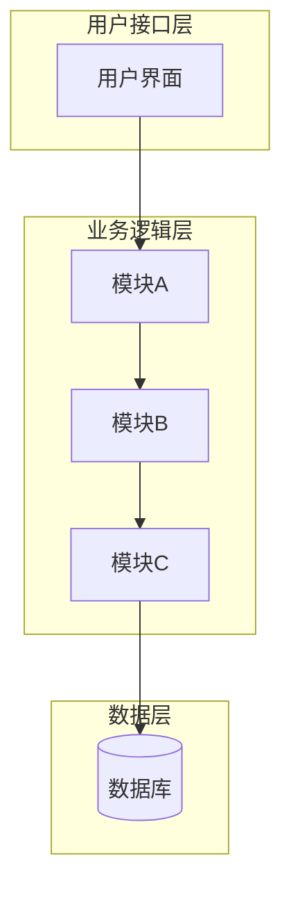
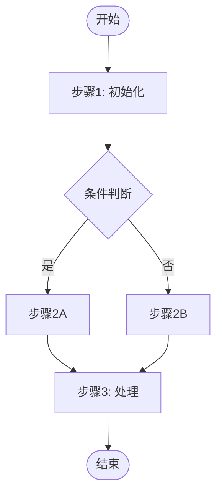
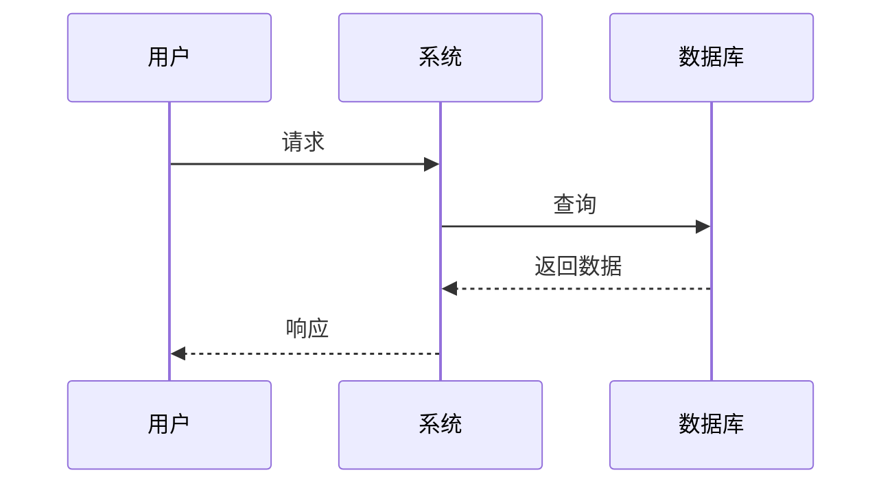
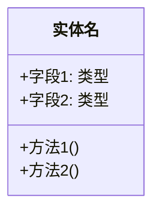

# 专利流程图标准

本文档定义了专利流程图的技术标准和规范，确保所有流程图符合国家知识产权局的审查要求。

## 1. 国家知识产权局对附图的要求

根据《专利审查指南》第二部分第二章第4.2节：

### 1.1 图片格式要求

| 项目 | 要求 |
|------|------|
| 提交格式 | PNG 或 JPG |
| 分辨率 | 至少 300 DPI |
| 尺寸 | A4纸大小（210mm × 297mm） |
| 颜色 | 黑白或灰度（不接受彩色） |

### 1.2 图片内容要求

| 项目 | 要求 |
|------|------|
| 线条 | 清晰，粗细均匀 |
| 文字 | 清晰可读，字号不小于 3.5mm |
| 标注语言 | 必须使用中文 |
| 禁止内容 | 不得包含商业广告 |

### 1.3 图片编号要求

- 使用"图1"、"图2"、"图3"连续编号
- 每张图下方标注图号
- 图号与说明书中的引用一致

### 1.4 流程图符号规范（GB/T 1526-1989）

| 符号 | 形状 | 用途 |
|------|------|------|
| 开始/结束 | 椭圆形 | 流程的起点和终点 |
| 处理步骤 | 矩形 | 具体的操作或处理 |
| 判断 | 菱形 | 条件判断，标注"是/否" |
| 数据 | 平行四边形 | 数据输入/输出 |
| 连接线 | 箭头 | 表示流程方向 |

## 2. 技术实现标准

### 2.1 技术栈

| 用途 | 工具/格式 |
|------|----------|
| 源文件 | SVG（可编辑，版本控制友好） |
| 提交文件 | PNG（300 DPI，黑白） |
| 生成工具 | Mermaid + 自动转换脚本 |

### 2.2 文件管理

每个流程图保存两种格式：

```
figures/
├── fig-01-system-architecture.svg    # 源文件（可编辑）
├── fig-01-system-architecture.png    # 提交文件（300 DPI）
├── fig-02-algorithm-flow.svg
├── fig-02-algorithm-flow.png
└── ...
```

## 3. 流程图类型

每个专利应包含以下类型的流程图：

### 3.1 系统架构图（必需）

**用途**：展示系统的整体结构和模块关系

**要素**：
- 主要模块（矩形框）
- 模块间关系（箭头）
- 数据流向（标注）
- 外部接口（虚线框）

**示例结构**：
```
┌─────────────────────────────────────────┐
│              用户接口层                  │
├─────────────────────────────────────────┤
│   ┌─────────┐  ┌─────────┐  ┌─────────┐ │
│   │ 模块A   │──│ 模块B   │──│ 模块C   │ │
│   └────┬────┘  └────┬────┘  └────┬────┘ │
│        │           │           │        │
│        └───────────┼───────────┘        │
│                    ▼                    │
│              ┌─────────┐                │
│              │ 数据层  │                │
│              └─────────┘                │
└─────────────────────────────────────────┘
```

### 3.2 算法流程图（必需）

**用途**：展示核心算法的执行步骤

**要素**：
- 开始/结束节点（椭圆）
- 处理步骤（矩形）
- 判断条件（菱形）
- 流程箭头

**示例结构**：
```
        ┌─────────┐
        │  开始   │
        └────┬────┘
             ▼
        ┌─────────┐
        │ 步骤1   │
        └────┬────┘
             ▼
        ◇─────────◇
       ╱  条件判断  ╲
      ╱             ╲
    是               否
     │               │
     ▼               ▼
┌─────────┐    ┌─────────┐
│ 步骤2A  │    │ 步骤2B  │
└────┬────┘    └────┬────┘
     └───────┬───────┘
             ▼
        ┌─────────┐
        │  结束   │
        └─────────┘
```

### 3.3 数据结构图（必需）

**用途**：展示关键数据结构的定义

**要素**：
- 类/结构体（矩形，三栏）
- 字段名和类型
- 关系连线

### 3.4 时序图（必需）

**用途**：展示多个实体间的交互时序

**要素**：
- 参与者（矩形）
- 生命线（虚线）
- 消息（箭头）
- 激活框（矩形）

### 3.5 对比图（可选）

**用途**：展示本发明与现有技术的对比

### 3.6 性能指标图（可选）

**用途**：展示实验结果和性能数据

## 4. Mermaid 模板

### 4.1 系统架构图模板



### 4.2 算法流程图模板



### 4.3 时序图模板



### 4.4 数据结构图模板



## 5. 样式规范

详细样式配置见 `figure-style.yaml`。

### 5.1 颜色

| 用途 | 颜色值 | 说明 |
|------|--------|------|
| 背景 | #FFFFFF | 白色 |
| 主线条 | #000000 | 黑色 |
| 辅助线 | #666666 | 灰色 |
| 文字 | #000000 | 黑色 |

### 5.2 字体

| 用途 | 字体 | 字号 |
|------|------|------|
| 图标题 | 黑体 | 16pt |
| 节点标签 | 黑体 | 12pt |
| 注释 | 黑体 | 10pt |

### 5.3 形状尺寸

| 形状 | 宽度 | 高度 | 边框 |
|------|------|------|------|
| 矩形（处理） | 120px | 60px | 2px |
| 菱形（判断） | 100px | 100px | 2px |
| 椭圆（开始/结束） | 100px | 50px | 2px |

### 5.4 布局

| 项目 | 值 |
|------|-----|
| 方向 | 从上到下（TB） |
| 水平间距 | 80px |
| 垂直间距 | 60px |
| 边距 | 40px |

## 6. 质量检查清单

生成流程图后，请检查：

- [ ] 分辨率达到 300 DPI
- [ ] 使用黑白或灰度颜色
- [ ] 尺寸适配 A4（210mm × 297mm）
- [ ] 文字使用中文标注
- [ ] 字号不小于 3.5mm
- [ ] 线条清晰，粗细均匀
- [ ] 流程方向从上到下、从左到右
- [ ] 判断框标注"是/否"
- [ ] 图号连续（图1、图2、图3...）
- [ ] 同时保存 SVG 和 PNG 格式
