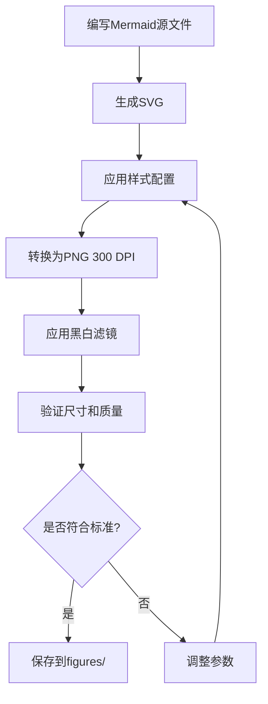

# 提案:专利文档标准化

**变更ID**: standardize-patent-documentation
**创建日期**: 2026-01-18
**状态**: 提案中

## 一、问题陈述

当前专利文档存在严重的组织混乱问题,影响专利申请的质量和效率:

### 1.1 目录命名混乱

```
当前状态:
docs/patents/
├── 01-FIFO钱龄计算/          # 数字编号
├── 02-多模态融合记账/
├── 06-位置增强管理/
├── 07-交易去重/
├── 10-账单解析导入/
├── 11-离线增量同步/
├── 13-游戏化激励/
├── 14-家庭协作记账/
├── 15-冷静期控制/
├── 16-可变收入适配/
├── 17-订阅追踪检测/
├── 18-债务健康管理/
├── 20-消费趋势预测/
├── A-差分隐私自学习/        # 字母编号(优化专利)
├── B-自适应零基预算/
├── C-LLM语音交互/
├── D-智能可视化系统/
├── D-自适应可视化/          # ❌ 重复的D
├── E-财务健康评分/
├── 专利01_xxx_v1.3.docx     # ❌ 旧版.docx文件在根目录
├── 专利01_xxx_v1.4.docx
├── 专利02_xxx_v1.2.docx
└── ...
```

**问题**:
- 数字编号和字母编号混用
- 存在重复目录(D-智能可视化系统 vs D-自适应可视化)
- 旧版.docx文件散落在根目录
- 编号不连续(缺少03、04、05、08、09、12、19)

### 1.2 文件命名不统一

```
当前状态:
13-游戏化激励/
├── 专利申请书_part1.md
└── 专利申请书_part2.md

15-冷静期控制/
└── 专利申请书.md            # ❌ 无part编号

16-可变收入适配/
├── 专利申请书_part1.md
├── 专利申请书_part2.md
└── 专利申请书_part3.md      # ❌ 有3个part

A-差分隐私自学习/
└── 技术交底书.md            # ❌ 不是"专利申请书"
```

**问题**:
- 有的专利分part,有的不分
- part数量不统一(1个、2个、3个)
- 文件类型不统一(专利申请书 vs 技术交底书)

### 1.3 缺少流程图

所有新创建的专利(13-20、A-E)都在申请书中列出了"附图说明",但实际上**没有创建任何流程图文件**。

```
专利申请书中列出:
[0017] 图1为多维度行为分析流程图;
[0018] 图2为自适应奖励计算流程图;
...

实际情况:
docs/patents/13-游戏化激励/
├── 专利申请书_part1.md
└── 专利申请书_part2.md
# ❌ 没有任何图片文件
```

### 1.4 版本管理混乱

```
专利01_FIFO资源池钱龄计算方法_v1.3.docx
专利01_FIFO资源池钱龄计算方法_v1.4.docx
专利02_多模态融合智能记账_v1.2.docx
专利04_零基预算动态分配_v1.1.docx
```

**问题**:
- 多个版本文件共存
- 无法确定哪个是最新版本
- 没有版本变更记录

## 二、目标

建立统一的专利文档标准,确保:

1. **符合专利局要求**: 流程图格式、文件命名、文档结构符合国家知识产权局的规范
2. **易于管理**: 清晰的目录结构、统一的命名规则、版本控制
3. **易于查找**: 标准化的编号系统、索引文件
4. **易于维护**: 自动化工具生成流程图、验证文档完整性

## 三、解决方案

### 3.1 统一的目录结构

```
docs/patents/
├── README.md                    # 专利组合总览
├── index.json                   # 专利索引(机器可读)
├── standards/                   # 标准规范
│   ├── naming-convention.md    # 命名规范
│   ├── figure-standards.md     # 流程图标准
│   └── document-template.md    # 文档模板
├── archive/                     # 归档旧版本
│   ├── v1.0/
│   └── v2.0/
└── patents/                     # 当前版本专利
    ├── P01-fifo-money-age/                    # 统一格式:P{编号}-{英文简称}
    │   ├── metadata.json                      # 元数据
    │   ├── specification.md                   # 说明书(完整版)
    │   ├── claims.md                          # 权利要求书
    │   ├── abstract.md                        # 摘要
    │   └── figures/                           # 流程图
    │       ├── fig-01-system-architecture.svg
    │       ├── fig-02-algorithm-flow.svg
    │       ├── fig-03-data-structure.svg
    │       ├── fig-04-calculation-process.svg
    │       ├── fig-05-comparison-chart.svg
    │       └── fig-06-performance-metrics.svg
    ├── P02-multimodal-bookkeeping/
    ├── P03-privacy-preserving-learning/       # 原"A-差分隐私自学习"
    ├── P04-adaptive-budget/                   # 原"B-自适应零基预算"
    ├── P05-llm-voice-interaction/             # 原"C-LLM语音交互"
    ├── P06-location-enhanced/
    ├── P07-transaction-deduplication/
    ├── P08-intelligent-visualization/         # 原"D-智能可视化系统"
    ├── P09-financial-health-scoring/          # 原"E-财务健康评分"
    ├── P10-bill-parsing/
    ├── P11-offline-sync/
    ├── P12-gamification/                      # 原"13-游戏化激励"
    ├── P13-family-collaboration/              # 原"14-家庭协作记账"
    ├── P14-cooling-off-period/                # 原"15-冷静期控制"
    ├── P15-variable-income-adapter/           # 原"16-可变收入适配"
    ├── P16-subscription-tracking/             # 原"17-订阅追踪检测"
    ├── P17-debt-management/                   # 原"18-债务健康管理"
    └── P18-consumption-prediction/            # 原"20-消费趋势预测"
```

**命名规则**:
- 专利目录: `P{两位数字编号}-{英文简称}`
- 英文简称: 小写字母,单词用连字符分隔,最多4个单词
- 编号连续: P01-P18,无跳号

### 3.2 统一的文件命名

每个专利目录包含:

```
P{XX}-{name}/
├── metadata.json              # 专利元数据
├── specification.md           # 说明书(完整版,不分part)
├── claims.md                  # 权利要求书(独立文件)
├── abstract.md                # 摘要(独立文件)
├── figures/                   # 流程图目录
│   ├── fig-01-{描述}.svg     # SVG格式(可编辑)
│   ├── fig-01-{描述}.png     # PNG格式(用于提交)
│   ├── fig-02-{描述}.svg
│   ├── fig-02-{描述}.png
│   └── ...
└── supplementary/             # 补充材料(可选)
    ├── experiments.md         # 实验数据
    ├── comparisons.md         # 对比分析
    └── references.md          # 参考文献
```

**文件命名规则**:
- 说明书: `specification.md` (不再分part,完整版)
- 权利要求书: `claims.md`
- 摘要: `abstract.md`
- 流程图: `fig-{两位数字}-{英文描述}.{svg|png}`

### 3.3 流程图标准(符合专利局要求)

#### 3.3.1 国家知识产权局对附图的要求

根据《专利审查指南》第二部分第二章第4.2节:

1. **图片格式**:
   - 提交时使用PNG或JPG格式
   - 分辨率: 至少300 DPI
   - 尺寸: A4纸大小(210mm × 297mm)
   - 颜色: 黑白或灰度(不接受彩色)

2. **图片内容**:
   - 线条清晰,粗细均匀
   - 文字清晰可读,字号不小于3.5mm
   - 使用中文标注
   - 图中不得包含商业广告

3. **图片编号**:
   - 图1、图2、图3...连续编号
   - 每张图下方标注"图X"

4. **流程图规范**:
   - 使用标准流程图符号(GB/T 1526-1989)
   - 流程方向: 从上到下,从左到右
   - 连接线: 使用箭头表示方向
   - 判断框: 菱形,标注"是/否"

#### 3.3.2 我们的流程图标准

**技术栈**:
- 源文件格式: SVG (可编辑,版本控制友好)
- 提交格式: PNG (300 DPI,黑白)
- 生成工具: Mermaid + 自动转换脚本

**样式规范**:
```yaml
# figure-style.yaml
colors:
  background: "#FFFFFF"        # 白色背景
  primary: "#000000"           # 黑色线条
  secondary: "#666666"         # 灰色辅助线
  text: "#000000"              # 黑色文字

fonts:
  family: "SimHei, Arial"      # 黑体(中文) + Arial(英文)
  size:
    title: 16pt                # 图标题
    label: 12pt                # 节点标签
    annotation: 10pt           # 注释

shapes:
  rectangle:                   # 矩形(处理步骤)
    width: 120px
    height: 60px
    border: 2px solid
    corner-radius: 4px

  diamond:                     # 菱形(判断)
    width: 100px
    height: 100px
    border: 2px solid

  ellipse:                     # 椭圆(开始/结束)
    width: 100px
    height: 50px
    border: 2px solid

lines:
  width: 2px                   # 连接线宽度
  arrow-size: 8px              # 箭头大小

layout:
  direction: TB                # Top to Bottom
  spacing:
    horizontal: 80px           # 水平间距
    vertical: 60px             # 垂直间距
  margin: 40px                 # 边距
```

**流程图类型模板**:

1. **系统架构图** (System Architecture)
   - 展示系统各模块及其关系
   - 使用矩形表示模块,箭头表示数据流

2. **算法流程图** (Algorithm Flow)
   - 展示算法执行步骤
   - 使用标准流程图符号

3. **数据结构图** (Data Structure)
   - 展示数据结构定义
   - 使用UML类图风格

4. **时序图** (Sequence Diagram)
   - 展示多个实体间的交互
   - 使用UML时序图风格

5. **对比图** (Comparison Chart)
   - 展示技术方案对比
   - 使用表格或柱状图

6. **性能指标图** (Performance Metrics)
   - 展示实验结果
   - 使用折线图或柱状图

### 3.4 元数据文件(metadata.json)

每个专利包含一个`metadata.json`文件,记录专利的元信息:

```json
{
  "patent_id": "P01",
  "patent_number": "CN202610XXXXXX.X",
  "title": {
    "zh": "基于FIFO资源池的钱龄计算方法",
    "en": "FIFO Resource Pool Based Money Age Calculation Method"
  },
  "inventors": ["李北华"],
  "applicant": "李北华",
  "filing_date": "2026-01-18",
  "status": "drafting",
  "category": "core-technology",
  "tags": ["FIFO", "资源池", "钱龄计算", "财务管理"],
  "estimated_success_rate": "85-90%",
  "related_patents": ["P02", "P04"],
  "version": "2.0",
  "changelog": [
    {
      "version": "2.0",
      "date": "2026-01-18",
      "changes": "重新组织文档结构,添加标准化流程图"
    },
    {
      "version": "1.4",
      "date": "2025-12-15",
      "changes": "优化算法描述,增加实施例"
    }
  ],
  "figures": [
    {
      "id": "fig-01",
      "title": "FIFO资源池系统架构",
      "type": "system-architecture",
      "file": "figures/fig-01-system-architecture.png"
    },
    {
      "id": "fig-02",
      "title": "钱龄计算算法流程",
      "type": "algorithm-flow",
      "file": "figures/fig-02-algorithm-flow.png"
    }
  ],
  "files": {
    "specification": "specification.md",
    "claims": "claims.md",
    "abstract": "abstract.md"
  }
}
```

### 3.5 专利索引文件(index.json)

在`docs/patents/`根目录创建`index.json`,提供专利组合的全局视图:

```json
{
  "portfolio": {
    "name": "AI记账应用专利组合",
    "total_patents": 18,
    "last_updated": "2026-01-18",
    "version": "2.0"
  },
  "categories": {
    "core-technology": {
      "name": "核心技术专利",
      "count": 8,
      "patents": ["P01", "P02", "P03", "P06", "P07", "P10", "P11"]
    },
    "user-experience": {
      "name": "用户体验专利",
      "count": 3,
      "patents": ["P12", "P13", "P08"]
    },
    "financial-management": {
      "name": "财务管理专利",
      "count": 7,
      "patents": ["P04", "P05", "P09", "P14", "P15", "P16", "P17", "P18"]
    }
  },
  "patents": [
    {
      "id": "P01",
      "title": "基于FIFO资源池的钱龄计算方法",
      "status": "drafting",
      "success_rate": "85-90%",
      "directory": "patents/P01-fifo-money-age/"
    },
    {
      "id": "P02",
      "title": "多模态融合智能记账方法",
      "status": "drafting",
      "success_rate": "80-85%",
      "directory": "patents/P02-multimodal-bookkeeping/"
    }
    // ... 其他专利
  ],
  "statistics": {
    "by_status": {
      "drafting": 18,
      "filed": 0,
      "granted": 0
    },
    "by_success_rate": {
      "high": 8,
      "medium": 10,
      "low": 0
    }
  }
}
```

## 四、实施计划

### 4.1 阶段1: 建立标准(1天)

1. 创建`docs/patents/standards/`目录
2. 编写标准文档:
   - `naming-convention.md`: 命名规范
   - `figure-standards.md`: 流程图标准
   - `document-template.md`: 文档模板
3. 创建流程图样式配置: `figure-style.yaml`

### 4.2 阶段2: 重组目录结构(1天)

1. 创建新的目录结构
2. 迁移现有文件到新结构
3. 合并分part的文件为完整版
4. 删除重复目录
5. 归档旧版.docx文件到`archive/`

### 4.3 阶段3: 生成流程图(2-3天)

1. 为每个专利创建Mermaid源文件
2. 使用自动化脚本转换为SVG和PNG
3. 验证流程图符合专利局要求
4. 更新说明书中的图片引用

### 4.4 阶段4: 生成元数据(1天)

1. 为每个专利创建`metadata.json`
2. 生成全局`index.json`
3. 生成`README.md`总览

### 4.5 阶段5: 验证与测试(1天)

1. 验证所有文件命名符合规范
2. 验证流程图质量
3. 验证文档完整性
4. 生成验证报告

## 五、技术实现

### 5.1 自动化工具

创建`scripts/patent-tools/`目录,包含:

1. **`generate-figures.py`**: 从Mermaid生成流程图
   ```python
   # 功能:
   # - 读取.mmd文件
   # - 使用mermaid-cli生成SVG
   # - 转换为300 DPI PNG
   # - 应用黑白样式
   ```

2. **`validate-patent.py`**: 验证专利文档完整性
   ```python
   # 检查:
   # - 必需文件是否存在
   # - 文件命名是否符合规范
   # - 流程图数量是否匹配
   # - metadata.json格式是否正确
   ```

3. **`migrate-patent.py`**: 迁移旧专利到新结构
   ```python
   # 功能:
   # - 读取旧目录结构
   # - 合并分part文件
   # - 创建新目录结构
   # - 生成metadata.json
   ```

4. **`generate-index.py`**: 生成专利索引
   ```python
   # 功能:
   # - 扫描所有专利目录
   # - 读取metadata.json
   # - 生成index.json
   # - 生成README.md
   ```

### 5.2 流程图生成流程



## 六、预期收益

1. **提高专利申请质量**:
   - 符合专利局规范,减少补正次数
   - 流程图清晰专业,提升审查员印象

2. **提高工作效率**:
   - 统一标准,减少重复工作
   - 自动化工具,节省手动操作时间

3. **便于管理维护**:
   - 清晰的目录结构,易于查找
   - 版本控制,追踪变更历史

4. **便于团队协作**:
   - 统一规范,降低沟通成本
   - 元数据文件,机器可读

## 七、风险与挑战

1. **迁移工作量大**: 18个专利需要重新组织
   - 缓解: 使用自动化脚本,分批迁移

2. **流程图生成复杂**: 需要学习Mermaid语法
   - 缓解: 提供模板和示例,逐步完善

3. **标准可能需要调整**: 实施过程中可能发现问题
   - 缓解: 采用迭代方式,持续优化

## 八、下一步行动

1. ✅ 创建此提案
2. ⏭️ 用户审核并批准提案
3. ⏭️ 创建详细的tasks.md
4. ⏭️ 开始实施阶段1: 建立标准
