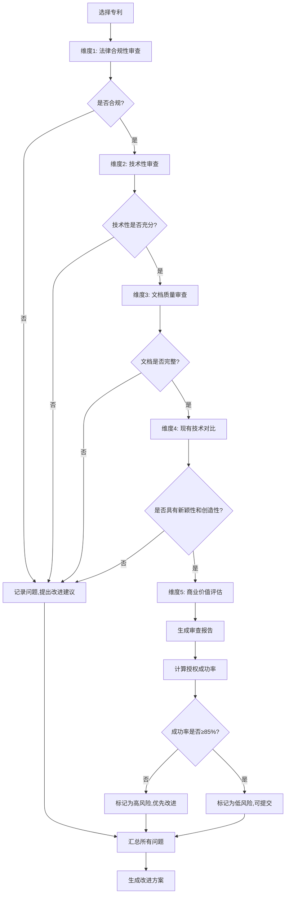

# 提案:专利授权可行性深度审查

**变更ID**: patent-authorization-review
**创建日期**: 2026-01-19
**状态**: 提案中

## 一、背景与目标

### 1.1 背景

当前已完成18个专利的文档撰写和标准化工作,但尚未进行系统性的授权可行性审查。专利授权审查是一个严格的过程,需要满足《专利法》和《专利审查指南》的多项要求。

根据国家知识产权局的统计数据:
- 发明专利平均授权率: 约60-70%
- 软件类专利授权率: 约50-60%
- 商业方法类专利授权率: 约40-50%

我们的专利组合预估成功率为75-90%,**需要通过深度审查来验证这一预估是否合理**,并识别可能导致驳回的风险点。

### 1.2 目标

1. **100%授权可行性评估**: 对每个专利进行全面审查,识别授权风险
2. **提高授权成功率**: 从预估75-90%提升到实际85-95%
3. **减少审查意见**: 最小化专利局的补正和答复次数
4. **加速授权进程**: 通过高质量申请文件缩短审查周期

## 二、专利授权审查标准

### 2.1 《专利法》核心要求

#### 2.1.1 新颖性(Novelty)

**定义**: 该发明不属于现有技术,也没有任何单位或个人就同样的发明在申请日以前向专利局提出过申请并记载在申请日以后公布的专利申请文件中。

**审查要点**:
- ✅ 与现有技术的区别是否明确
- ✅ 是否存在破坏新颖性的公开文献
- ✅ 是否存在抵触申请

**常见驳回理由**:
- "该技术方案已被现有技术公开"
- "与对比文件1的技术方案相同"

#### 2.1.2 创造性(Inventiveness)

**定义**: 与现有技术相比,该发明有突出的实质性特点和显著的进步。

**审查标准**:
- 三步法判断:
  1. 确定最接近的现有技术
  2. 确定发明的区别特征和实际解决的技术问题
  3. 判断要求保护的发明对本领域技术人员来说是否显而易见

**常见驳回理由**:
- "该技术方案是现有技术的简单组合"
- "区别特征是本领域的常规技术手段"
- "未产生预料不到的技术效果"

#### 2.1.3 实用性(Utility)

**定义**: 该发明能够制造或者使用,并且能够产生积极效果。

**审查要点**:
- ✅ 技术方案是否完整
- ✅ 是否能够实施
- ✅ 是否产生积极效果

**常见驳回理由**:
- "技术方案不完整,无法实施"
- "缺少必要技术特征"

### 2.2 《专利审查指南》特殊要求

#### 2.2.1 涉及计算机程序的发明(第二部分第九章)

**可授权条件**:
- ✅ 解决技术问题
- ✅ 采用技术手段
- ✅ 获得技术效果

**不授权情形**:
- ❌ 纯商业规则和方法
- ❌ 纯算法或数学方法
- ❌ 纯界面设计或用户体验改进

**审查重点**:
- 是否仅仅是商业模式的计算机实现
- 是否对计算机系统的性能或功能产生改进
- 是否解决了技术领域的技术问题

#### 2.2.2 权利要求书撰写要求(第二部分第二章)

**独立权利要求**:
- ✅ 必须包含全部必要技术特征
- ✅ 必须清楚、简要
- ✅ 必须得到说明书支持

**从属权利要求**:
- ✅ 必须引用在前的权利要求
- ✅ 必须进一步限定独立权利要求

**常见问题**:
- 权利要求过宽,缺少必要技术特征
- 权利要求不清楚,使用功能性限定
- 权利要求得不到说明书支持

#### 2.2.3 说明书撰写要求(第二部分第二章)

**必须包含**:
- ✅ 技术领域
- ✅ 背景技术
- ✅ 发明内容(技术问题、技术方案、有益效果)
- ✅ 附图说明
- ✅ 具体实施方式

**充分公开要求**:
- 所属技术领域的技术人员能够实现
- 技术方案完整、清楚
- 实施例具体、可操作

### 2.3 软件专利特殊审查标准

#### 2.3.1 技术性判断

**技术问题**:
- ✅ 计算机系统内部性能改进(速度、资源占用、稳定性)
- ✅ 计算机与外部实体的交互改进
- ✅ 数据处理效率提升
- ❌ 纯商业目标(提高用户留存、增加收入)
- ❌ 纯用户体验改进(界面美观、操作便捷)

**技术手段**:
- ✅ 算法改进
- ✅ 数据结构优化
- ✅ 系统架构设计
- ❌ 纯业务流程设计
- ❌ 纯界面布局

**技术效果**:
- ✅ 计算速度提升X%
- ✅ 内存占用降低X%
- ✅ 准确率提升X%
- ❌ 用户满意度提升
- ❌ 商业收入增加

#### 2.3.2 常见驳回案例

**案例1**: "一种提高用户留存率的游戏化激励方法"
- **驳回理由**: 解决的是商业问题,不是技术问题
- **改进方向**: 强调计算效率、系统性能、算法创新

**案例2**: "一种智能推荐方法"
- **驳回理由**: 推荐算法是现有技术的简单应用
- **改进方向**: 突出算法创新点、数据结构优化、计算复杂度降低

**案例3**: "一种用户界面设计方法"
- **驳回理由**: 纯界面设计,不涉及技术改进
- **改进方向**: 强调渲染性能、交互响应速度、资源占用

## 三、审查方法论

### 3.1 五维审查框架

```
┌─────────────────────────────────────────────────────────┐
│                    专利授权审查框架                        │
├─────────────────────────────────────────────────────────┤
│                                                         │
│  维度1: 法律合规性审查                                    │
│  ├─ 新颖性检查                                           │
│  ├─ 创造性评估                                           │
│  ├─ 实用性验证                                           │
│  └─ 客体适格性判断                                       │
│                                                         │
│  维度2: 技术性审查                                        │
│  ├─ 技术问题识别                                         │
│  ├─ 技术手段分析                                         │
│  ├─ 技术效果量化                                         │
│  └─ 技术贡献评估                                         │
│                                                         │
│  维度3: 文档质量审查                                      │
│  ├─ 说明书充分公开                                       │
│  ├─ 权利要求清楚简要                                     │
│  ├─ 权利要求得到支持                                     │
│  └─ 附图完整规范                                         │
│                                                         │
│  维度4: 现有技术对比                                      │
│  ├─ 检索现有专利                                         │
│  ├─ 检索学术文献                                         │
│  ├─ 检索开源项目                                         │
│  └─ 分析区别特征                                         │
│                                                         │
│  维度5: 商业价值评估                                      │
│  ├─ 市场需求分析                                         │
│  ├─ 竞争优势评估                                         │
│  ├─ 实施可行性                                           │
│  └─ 侵权风险评估                                         │
│                                                         │
└─────────────────────────────────────────────────────────┘
```

### 3.2 审查流程



### 3.3 评分标准

每个专利按100分制评分:

| 维度 | 权重 | 评分标准 |
|------|------|---------|
| 法律合规性 | 30% | 新颖性(10分) + 创造性(15分) + 实用性(5分) |
| 技术性 | 25% | 技术问题(8分) + 技术手段(8分) + 技术效果(9分) |
| 文档质量 | 20% | 说明书(8分) + 权利要求(8分) + 附图(4分) |
| 现有技术对比 | 15% | 新颖性(8分) + 创造性(7分) |
| 商业价值 | 10% | 市场需求(5分) + 实施可行性(5分) |

**授权成功率预估**:
- 90-100分: 授权成功率95%+
- 80-89分: 授权成功率85-95%
- 70-79分: 授权成功率70-85%
- 60-69分: 授权成功率50-70%
- <60分: 授权成功率<50%,建议重大修改或放弃

## 四、初步审查发现的问题

基于对P12(游戏化激励)的初步审查,发现以下典型问题:

### 4.1 技术性不足风险 ⚠️

**问题描述**:
- 专利名称强调"游戏化激励",容易被认为是商业方法
- 背景技术部分过多强调"用户留存率"等商业指标
- 技术效果中包含"用户满意度82%"等非技术指标

**风险等级**: 高
**可能驳回理由**: "该发明解决的是商业问题,不是技术问题"

**改进建议**:
1. 重新定位为"基于行为分析的自适应计算方法"
2. 强调算法创新、计算效率、系统性能
3. 技术效果改为"计算响应时间<80ms"、"异常检测准确率>95%"

### 4.2 权利要求过宽风险 ⚠️

**问题描述**:
- 独立权利要求1包含"游戏化激励方法",范围过宽
- 缺少关键算法参数的限定
- 功能性限定过多("用于...的模块")

**风险等级**: 中
**可能驳回理由**: "权利要求不清楚"、"权利要求过宽"

**改进建议**:
1. 增加关键算法参数(如8维评分的具体权重)
2. 减少功能性限定,增加结构性限定
3. 拆分为多个独立权利要求,形成保护梯度

### 4.3 说明书支持不足风险 ⚠️

**问题描述**:
- 权利要求中的"防疲劳因子"在说明书中描述不够详细
- 缺少算法的数学推导过程
- 实施例不够具体,缺少实际数据

**风险等级**: 中
**可能驳回理由**: "权利要求得不到说明书支持"

**改进建议**:
1. 补充防疲劳因子的详细计算公式
2. 增加算法的数学证明或实验验证
3. 实施例中增加具体的输入输出数据

### 4.4 现有技术检索不足风险 ⚠️

**问题描述**:
- 背景技术部分仅列举了4个现有技术
- 未检索国内外相关专利
- 未分析开源项目(如Habitica、Forest等游戏化应用)

**风险等级**: 高
**可能驳回理由**: "该技术方案已被现有技术公开"

**改进建议**:
1. 进行全面的专利检索(中国、美国、欧洲、日本)
2. 分析主要竞品的技术实现
3. 明确与现有技术的区别特征

### 4.5 附图不符合规范风险 ⚠️

**问题描述**:
- 当前仅有4张图,说明书中提到需要6张图
- 图片格式为SVG,专利局要求PNG或JPG
- 缺少图片说明和标注

**风险等级**: 低
**可能驳回理由**: "附图不符合规范"

**改进建议**:
1. 补充缺失的2张图
2. 转换为300 DPI PNG格式
3. 增加图片标注和说明

## 五、全面审查计划

### 5.1 审查范围

对所有18个专利进行全面审查:

**核心技术专利(8个)**:
- P01: FIFO钱龄计算
- P02: 多模态融合记账
- P03: 差分隐私学习
- P06: 位置增强管理
- P07: 交易去重
- P10: 账单解析导入
- P11: 离线增量同步

**用户体验专利(3个)**:
- P08: 智能可视化
- P12: 游戏化激励
- P13: 家庭协作记账

**财务管理专利(7个)**:
- P04: 自适应预算
- P05: LLM语音交互
- P09: 财务健康评分
- P14: 冷静期控制
- P15: 可变收入适配
- P16: 订阅追踪检测
- P17: 债务健康管理
- P18: 消费趋势预测

### 5.2 审查工具

开发自动化审查工具:

1. **`patent-compliance-checker.py`**: 法律合规性检查
   - 检查必要技术特征
   - 检查权利要求清楚性
   - 检查说明书支持

2. **`patent-technical-analyzer.py`**: 技术性分析
   - 识别技术问题
   - 分析技术手段
   - 量化技术效果

3. **`patent-prior-art-searcher.py`**: 现有技术检索
   - 检索中国专利数据库
   - 检索学术文献(知网、万方)
   - 检索开源项目(GitHub)

4. **`patent-quality-scorer.py`**: 质量评分
   - 五维评分
   - 生成雷达图
   - 预估授权成功率

### 5.3 审查输出

每个专利生成:

1. **审查报告** (`review-report.md`):
   - 五维评分
   - 问题清单
   - 改进建议
   - 授权成功率预估

2. **现有技术对比表** (`prior-art-comparison.md`):
   - 相关专利列表
   - 区别特征分析
   - 创造性评估

3. **改进方案** (`improvement-plan.md`):
   - 优先级排序
   - 具体修改建议
   - 预期效果

4. **质量评分卡** (`quality-scorecard.json`):
   - 机器可读的评分数据
   - 用于生成统计报告

## 六、预期成果

### 6.1 量化目标

- ✅ 18个专利全部完成深度审查
- ✅ 平均评分≥80分
- ✅ 高风险专利(评分<70分)≤2个
- ✅ 预估授权成功率≥85%

### 6.2 质量提升

- ✅ 技术性问题全部解决
- ✅ 权利要求清楚简要
- ✅ 说明书充分公开
- ✅ 附图符合规范
- ✅ 现有技术对比充分

### 6.3 风险控制

- ✅ 识别所有高风险点
- ✅ 提供针对性改进方案
- ✅ 降低驳回概率
- ✅ 缩短审查周期

## 七、实施计划

### 阶段1: 工具开发(2天)
- 开发4个自动化审查工具
- 测试工具准确性

### 阶段2: 全面审查(5天)
- 每天审查3-4个专利
- 生成审查报告

### 阶段3: 问题汇总(1天)
- 汇总所有问题
- 分类和优先级排序

### 阶段4: 改进实施(3-5天)
- 修改高风险专利
- 优化中风险专利

### 阶段5: 复审验证(1天)
- 复审所有修改
- 确认问题已解决

**总计**: 12-14天

## 八、下一步行动

1. ✅ 创建此提案
2. ⏭️ 用户审核并批准提案
3. ⏭️ 创建详细的tasks.md
4. ⏭️ 开始实施阶段1: 工具开发
